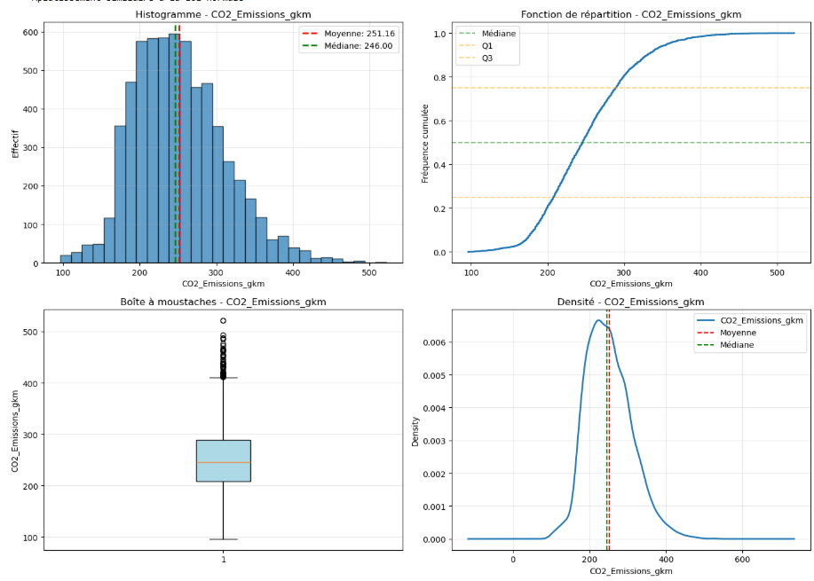
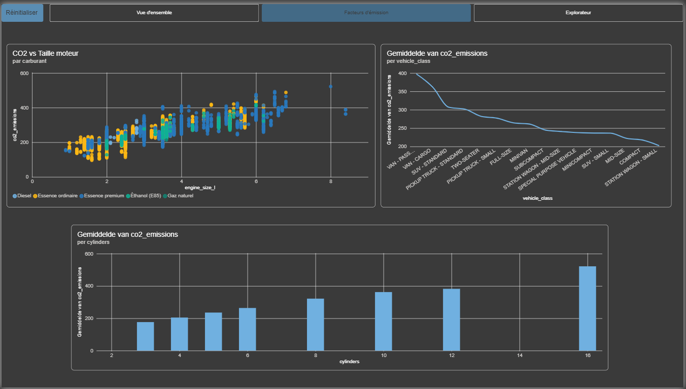
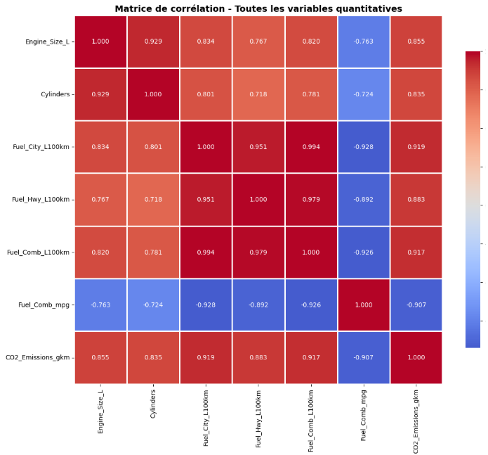
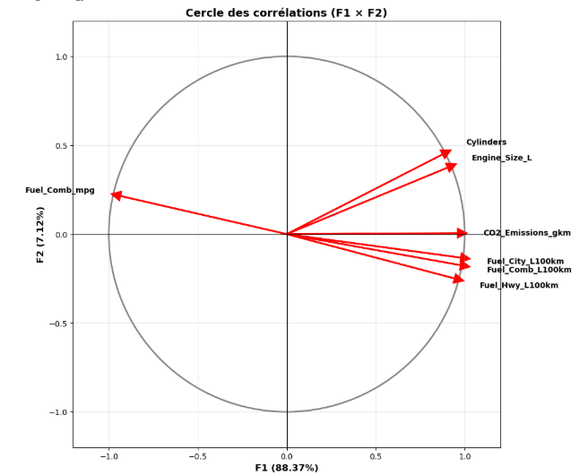
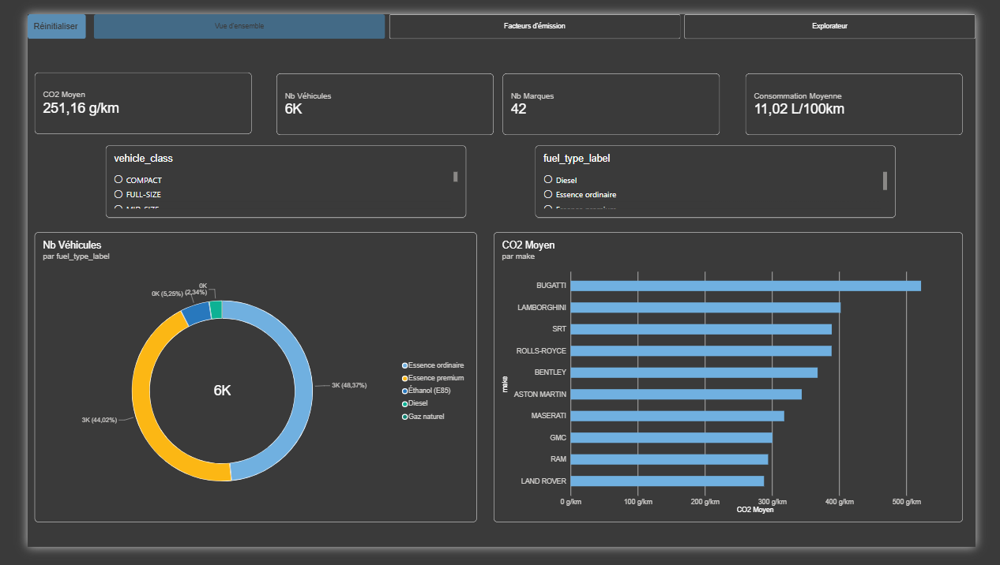
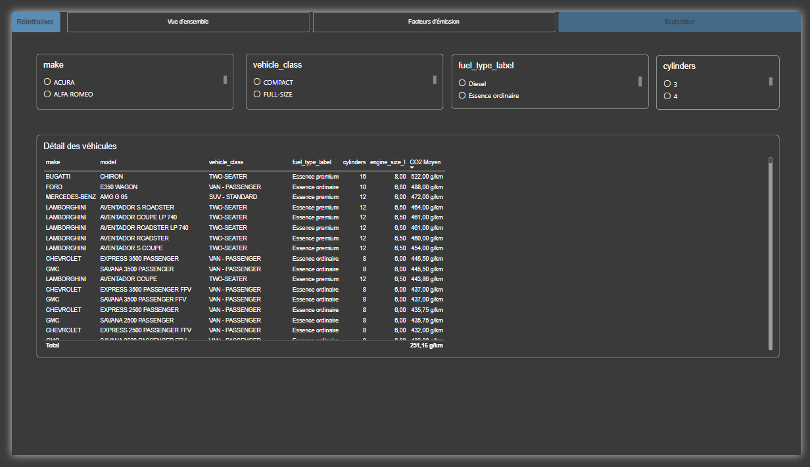

# 🚗 Analyse des émissions de CO2 des véhicules

Projet d'analyse de données visant à identifier les facteurs techniques influençant les émissions de CO2 des véhicules, de la donnée brute jusqu'à un dashboard interactif.

## 📌 Objectif

Explorer les relations entre les caractéristiques techniques des voitures (taille du moteur, nombre de cylindres, consommation de carburant) et leurs émissions de CO2, à travers une chaîne complète : nettoyage → analyse statistique (univariée, bivariée, multivariée) → modélisation en base de données → restitution visuelle.

## 🗂️ Source des données

Dataset **CO2 Emissions by Vehicles** (Kaggle), 7385 véhicules, 12 variables (marque, modèle, classe, taille moteur, cylindres, transmission, type de carburant, consommations, émissions CO2).

## 🛠️ Architecture technique

\`\`\`
CSV brut (co2.csv)
    │
    ▼
Nettoyage & analyses (Python / Pandas, Jupyter)
    ├── Nettoyage_des_données.ipynb
    ├── Analyse_monovarié.ipynb
    ├── Analyse_bivariée.ipynb
    └── Analyse multivarié.ipynb
    │
    ▼
Co2_Nettoye.csv (données propres)
    │
    ▼
Modélisation en schéma en étoile + export MySQL (Export_MySQL.ipynb)
    ├── dim_marque
    ├── dim_modele
    ├── dim_carburant
    └── fait_emissions
    │
    ▼
Dashboard Power BI (connexion directe MySQL)
\`\`\`

## 📊 Méthodologie et résultats

### 1️⃣ Analyse univariée

Étude de la distribution de la variable cible (\`CO2_Emissions_gkm\`) : histogramme, fonction de répartition, boîte à moustaches et densité. On observe une distribution asymétrique, une moyenne à 251,16 g/km, une médiane à 246 g/km, et quelques outliers au-delà de 400 g/km correspondant aux véhicules à grosse cylindrée.

### 2️⃣ Analyse bivariée

Étude des relations entre paires de variables (ex: taille moteur vs CO2), avec droite de régression et analyse des résidus, pour quantifier la force et le sens de chaque relation.

### 3️⃣ Analyse multivariée

**Matrice de corrélation** entre toutes les variables quantitatives : la consommation de carburant est le meilleur prédicteur du CO2 (corrélation ≈ 0,92), suivie de la taille moteur et du nombre de cylindres (≈ 0,85 et 0,83).

**Cercle des corrélations (ACP)** : projection des variables sur les deux premières composantes principales, confirmant que les variables de consommation et d'émission portent la même information (elles pointent dans la même direction).

## 📈 Dashboard Power BI

**🔗 Dashboard en ligne :** [Consulter le dashboard interactif](https://app.powerbi.com/links/B_ZifoEIbt?ctid=94b7f9d8-dbe9-43e8-9d31-560afae9d20c&pbi_source=linkShare&bookmarkGuid=e0a85bdc-d543-4422-a867-ada42ca34f4d)

### Vue d'ensemble
KPI globaux (CO2 moyen, nombre de véhicules, nombre de marques, consommation moyenne), répartition par type de carburant, top marques les plus émettrices.

### Facteurs d'émission
Relation CO2 / taille moteur par carburant, CO2 moyen par classe de véhicule, CO2 moyen par nombre de cylindres.

### Explorateur
Table détaillée avec filtres croisés (marque, classe de véhicule, carburant, cylindres) pour une exploration libre des données.

## 🧰 Stack technique

- **Python** : Pandas, NumPy, SciPy (nettoyage, statistiques descriptives, régression, ACP)
- **Jupyter Notebook**
- **MySQL** : modélisation en schéma en étoile (SQLAlchemy pour l'export)
- **Power BI** : DAX, modèle relationnel, dashboard interactif multi-pages, publié sur Power BI Service

## 📁 Structure du dépôt

\`\`\`
├── co2.csv                          # Dataset brut
├── Co2_Nettoye.csv                  # Dataset nettoyé
├── Nettoyage_des_données.ipynb      # Nettoyage
├── Analyse_monovarié.ipynb          # Analyse univariée
├── Analyse_bivariée.ipynb           # Analyse bivariée
├── Analyse multivarié.ipynb         # Analyse multivariée
├── Export_MySQL.ipynb               # Modélisation + export vers MySQL
├── assets/                          # Captures d'écran (analyses + dashboard)
└── README.md
\`\`\`

## 👤 Auteur

**Ali Elyousfi** — Étudiant en Master 2 Ingénierie des Systèmes Complexes, EILCO (ULCO)
[LinkedIn](https://linkedin.com/in/elyousfi-ali) · [GitHub](https://github.com/ELYOUSFI123)
